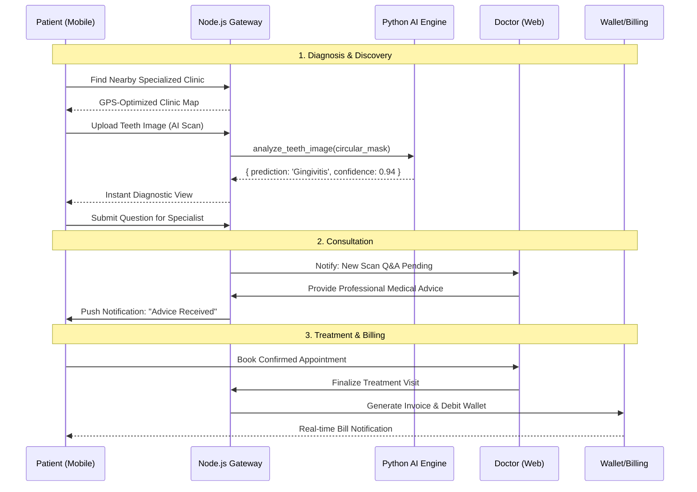

# 🦷 DentalCare+ — Unified Intelligence for Global Oral Health

**DentalCare+** is a world-class, multi-platform healthcare ecosystem designed to democratize access to precise dental diagnostics. By fusing **Artificial Intelligence (EfficientNet-B3)**, **Real-time Eventing (Socket.io)**, and **Geospatial Intelligence**, we provide a seamless, end-to-end medical experience that connects patients with professional dental expertise instantly.

---

## 📖 Essential Documentation

| Resource | Scope |
| :--- | :--- |
| **[🌐 Interactive documentation Portal](docs/index.html)** | **High-Level Overview.** Live diagrams, architecture maps, and visual role guides. |
| **[📘 Master User Manual](docs/USER_MANUAL.md)** | **Technical Deep-Dive.** Exhaustive ERDs, Class Diagrams, and role-specific tutorials. |

---

## 🏛️ System Architecture Masterplan

DentalCare+ is built on a distributed **4-Layer Medical Stack** designed for high availability and sub-second response times.

1.  **📱 Mobile Edge (Patient)**: Developed with **Flutter (Dart)** using the BLoC pattern for a reactive, state-consistent patient experience.
2.  **💻 Clinical Web (Doctor/Admin)**: Developed with **React 19**, utilizing **Tailwind CSS 4** and **Framer Motion** for a high-end, clinical-grade interface.
3.  **⚙️ Orchestration API (Backend)**: An **Express.js (Node.js 18)** gateway managing stateless **JWT Authentication**, real-time **Socket.io** eventing, and **Mongoose** data persistence.
4.  **🤖 Intelligence Service (AI)**: A specialized **Python Flask** service performing deep-learning inference via **PyTorch** for diagnostic classification.

---

## 🔄 The Master User Storyboard

Trace the journey of a single patient case through the ecosystem:

---

## 📦 Enterprise Feature Catalog

DentalCare+ is structured into four functional domains, providing a complete 360° health management platform.

### 🤖 1. Clinical Intelligence (AI Engine)
- **Neural Classification**: detects 5 critical dental pathologies: **Calculus, Cancers, Gingivitis, Mouth Ulcers,** and **Oral Lichen Planus (OLP)**.
- **Circular Masking**: Specialized computer vision pre-processing to focus neural attention on the oral cavity.
- **Diagnostic Confidence**: High-precision probability metrics displayed for every AI scan.
- **Human-in-the-Loop**: Seamless workflow for doctors to verify AI predictions and provide human-led advice.

### 📅 2. Medical Operations (Clinical Hub)
- **Geo-Discovery**: Google Maps integration for sub-second search of nearby dental hospitals and specialists.
- **Smart Scheduling**: 30/60-minute interval slot management with real-time doctor availability calendars.
- **Treatment Vault**: Centralized Electronic Health Records (EHR) for all **Medical Reports** and **Treatment History**.
- **Emergency Center**: Location-based one-tap access to emergency dental services.

### 💳 3. Financial Intelligence (FinTech)
- **Integrated Digital Wallet**: Virtual balance system for immediate payment of medical services.
- **Automated Invoicing**: Instant line-item billing generated upon doctor treatment finalization.
- **Transaction Audit**: immutable history of all top-ups, payments, and bill generations.

### 🛡️ 4. System Governance (Admin)
- **Personnel Verification**: Enterprise-grade onboarding for medical professionals with license verification.
- **Clinic Registry**: Master management of the medical network hospitals and their coordinates.
- **Audit Logging**: Comprehensive system activity trails for administrative oversight and stability monitoring.

---

## 🚀 Automated DevOps Architecture (CI/CD)
The platform maintains an enterprise-grade stability score through a **5-Job parallel pipeline** in GitHub Actions (`ci.yml`).

| Job | Responsibility | Verification Logic |
| :--- | :--- | :--- |
| **Backend** | API Health | Node.js 20 environment check + Cold Start server verification. |
| **Frontend** | Build Integrity | Production asset bundling verification using React 19. |
| **Docker** | Infrastructure | simultaneous build verification of `backend`, `frontend`, and `ai-model` containers. |
| **Mobile** | Environment | Flutter stable-channel verification and pub-dependency checks. |
| **Summary** | Quality Gate | Consolidated report of all parallel stages for PR approval. |

---

## 🛠️ System Setup Masterclass

### 🐳 Scenario A: Docker Deployment (Recommended)
1. **Prerequisites**: Ensure Docker and Docker Compose are installed.
2. **Environment**: `cp .env.example .env` (Configure your `JWT_SECRET`).
3. **Launch**: `docker-compose up -d --build`
4. **Initialize**: Log into `localhost:4000` to verify API health.

### 💻 Scenario B: Manual Service Orchestration
1.  **AI Engine**: `cd backend/models && pip install -r requirements.txt && python flask_api.py`
2.  **Core Gateway**: `cd backend && npm install && npm run dev`
3.  **Doctor Portal**: `cd frontend && npm install && npm start`
4.  **Patient App**: `cd mobile && flutter pub get && flutter run`

---

## 🔌 API Surface Reference (Key Endpoints)

| Method | Endpoint | Port | Description |
| :--- | :--- | :---: | :--- |
| `POST` | `/api/ai-scan/teeth-scan` | 4000 | Upload image for multi-class AI analysis. |
| `POST` | `/api/auth/register` | 4000 | Register new patient with email verification. |
| `GET` | `/api/doctors/available-now` | 4000 | Fetchclinicians with active availability slots. |
| `POST` | `/api/scan-qa/:id/answer` | 4000 | (Doctor only) Submit advice on AI scan results. |
| `POST` | `/predict` | 5000 | (Internal) Direct AI model inference endpoint. |

---
© 2026 DentalCare+ | Excellence in Dental Intelligence.
