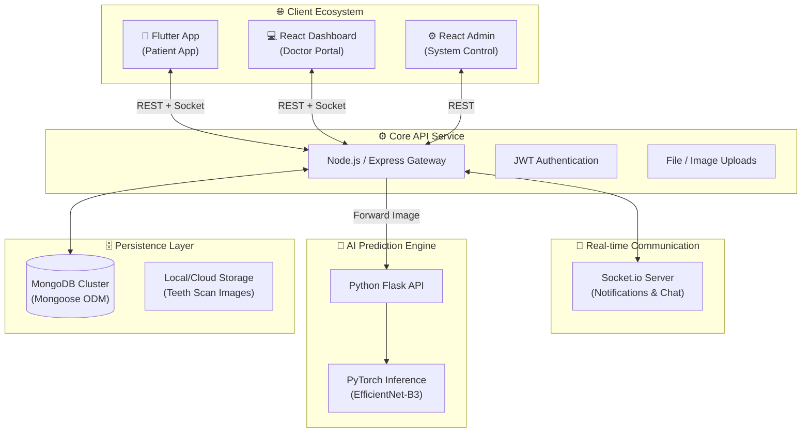
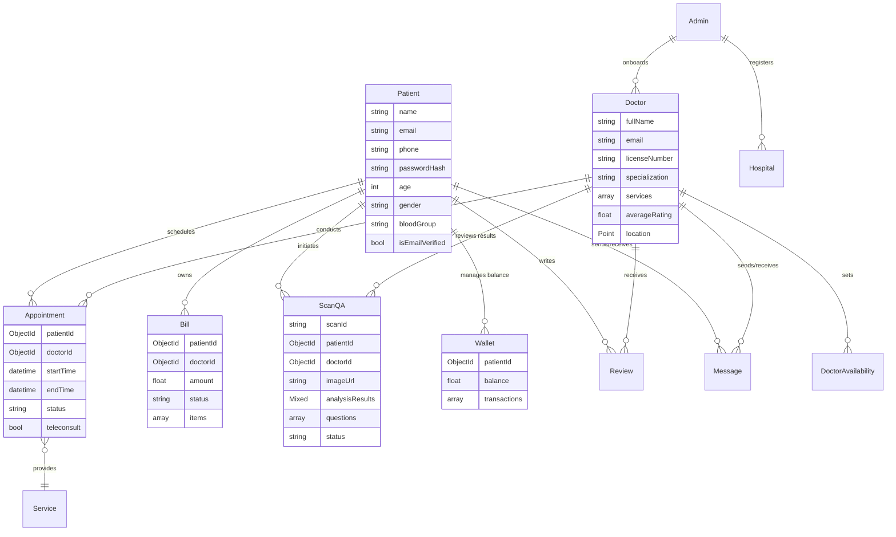
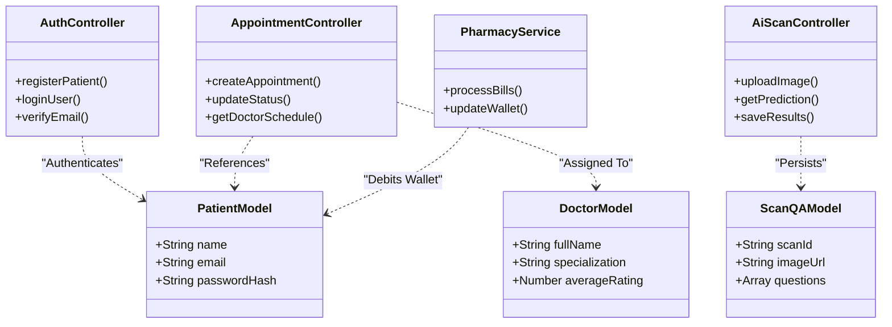
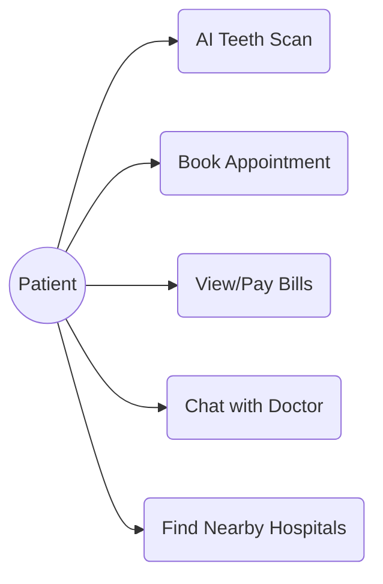
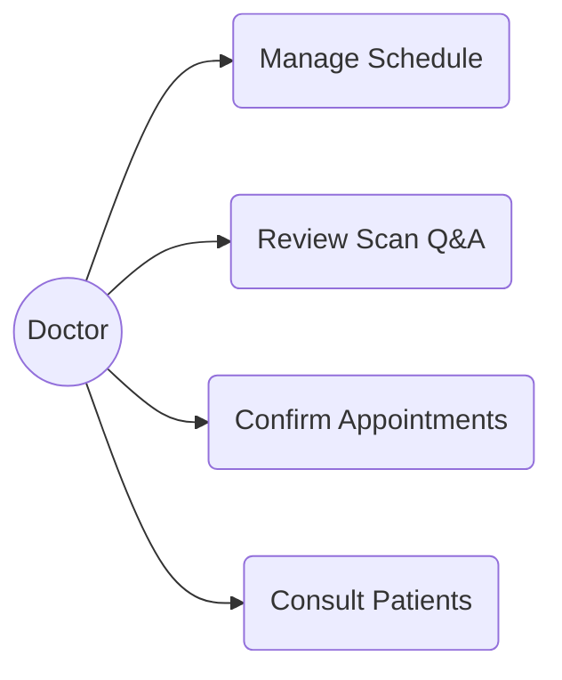
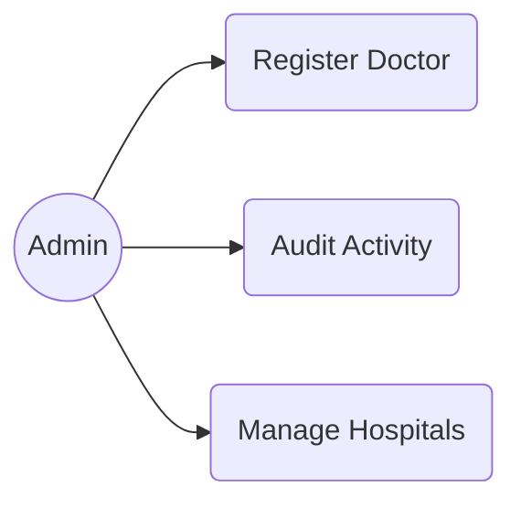
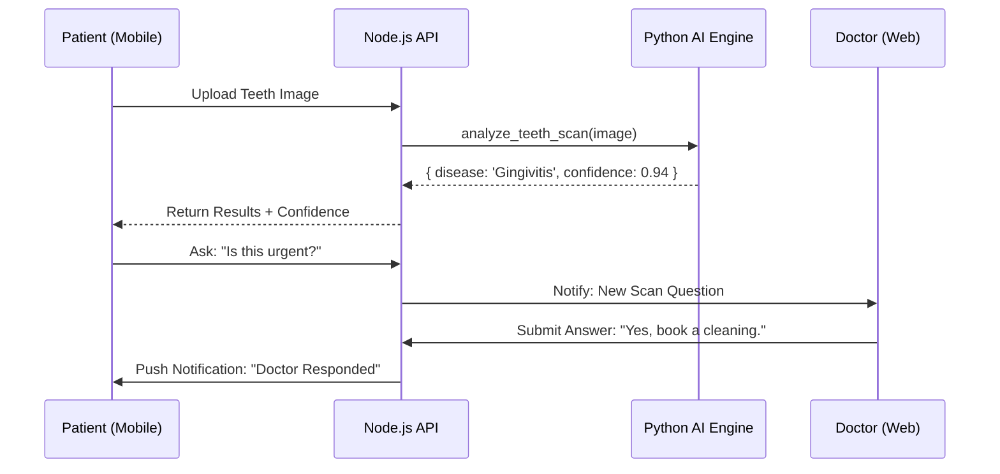
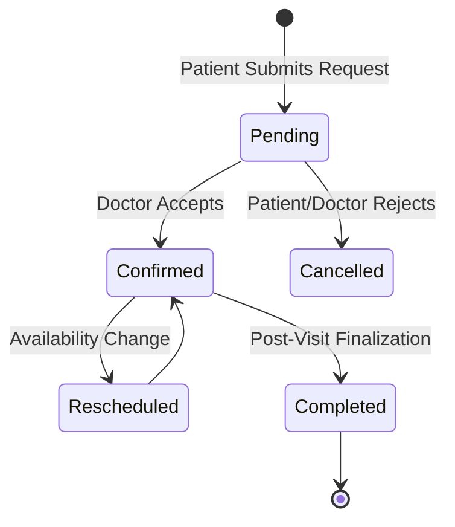

# 📘 DentalCare+ — Complete Master User Manual & System Reference

> **Version 2.0** | Comprehensive end-to-end documentation for Patients, Doctors, and Administrators.

---

## 📋 Table of Contents

- [1. System Architecture Overview](#1-system-architecture-overview)
- [2. Data Model — Entity Relationship Diagram (ERD)](#2-data-model--entity-relationship-diagram-erd)
- [3. System Class Diagram](#3-system-class-diagram)
- [4. Role-Based Use Case Diagrams](#4-role-based-use-case-diagrams)
- [5. Feature Lifecycle & Workflows](#5-feature-lifecycle--workflows)
- [6. Patient Guide — Flutter Mobile App](#6-patient-guide--flutter-mobile-app)
- [7. Doctor Guide — React Web Dashboard](#7-doctor-guide--react-web-dashboard)
- [8. Administrator Guide — System Control](#8-administrator-guide--system-control)
- [9. Technical Reference & Deployment](#9-technical-reference--deployment)

---

## 1. System Architecture Overview

DentalCare+ uses a distributed micro-services approach to manage high-traffic dental operations and real-time AI processing.

---

## 2. Data Model — Entity Relationship Diagram (ERD)

The system manages 14 core entities across a non-relational MongoDB schema, utilizing references for cross-entity relationships.

---

## 3. System Class Diagram

High-level logical structure showing how the Backend Controllers interface with Mongoose Models and the Clients.

---

## 4. Role-Based Use Case Diagrams

Defining the primary interactions for each system stakeholder.

### 📱 Patient Use Cases (Mobile)

### 👨‍⚕️ Doctor Use Cases (Web)

### ⚙️ Admin Use Cases (Web)

---

## 5. Feature Lifecycle & Workflows

### 🦷 AI Scan & Consultation Lifecycle
Detailed sequence from image capture to professional advice.

### 📅 Appointment State Machine
Visualizing the transitions of a booking request.

---

## 6. Patient Guide — Flutter Mobile App

### 🏠 Dashboard
The home screen provides a 360-degree view of your oral health:
- **Health Score**: A dynamic metric calculated based on scan history and appointment consistency.
- **Wallet Balance**: Quick view of your current funds for automated billing.
- **Top Actions**: Quick-access buttons for AI Scan and Find Doctors.

### 🧪 AI Teeth Scan
A core feature that puts a digital dentist in your pocket:
- **Circular Masking**: The app guides you to align your teeth within a circular frame for optimal AI accuracy.
- **AI Engine**: Uses EfficientNet-B3 to detect Calculus, Gingivitis, Ulcers, and more.
- **History**: All previous scans are saved for timeline tracking.

---

## 7. Doctor Guide — React Web Dashboard

### 📅 Managing Availability
Doctors must set their "Availability Slots" to appear in patient searches:
- **Weekly Slots**: Configure daily start/end times.
- **Override**: Mark specific days as vacation or unavailable.

### 💬 Real-Time Messaging
Integrates Socket.io for instant patient communication:
- **Chat Interface**: Unified inbox for all patients with pending appointments.
- **File Sharing**: Send reports or prescriptions directly within the chat.

---

## 8. Administrator Guide — System Control

### 👨‍⚕️ Global Staffing
Admins can onboard doctors from the **Admin Panel**:
- **Credentials**: Upload and verify medical licenses.
- **Affiliation**: Assign doctors to specific hospitals in the Google Maps overlay.

### 🏥 Hospital Management
- **Geocoding**: Add hospitals with Latitude/Longitude for the patient "Nearby" search.
- **Contact Info**: Manage centralized emergency numbers for every facility.

---

## 9. Technical Reference & Deployment

### 🐳 Containerization
The system is fully Dockerized for "Infrastructure as Code" delivery:
- `docker-compose.yml` orchestrates MongoDB, AI Service, Backend, and Frontend.
- Use `docker-compose up -d` for a "One-Click" production-ready deployment.

### 🛠️ Developer Scripts
Found in the `backend/` directory:
- `node createAdmin.js`: Initialize the system superuser.
- `npm run seed-services`: Populate default dental categories.

---
*© 2026 DentalCare+ | Intelligence in Every Smile.*
